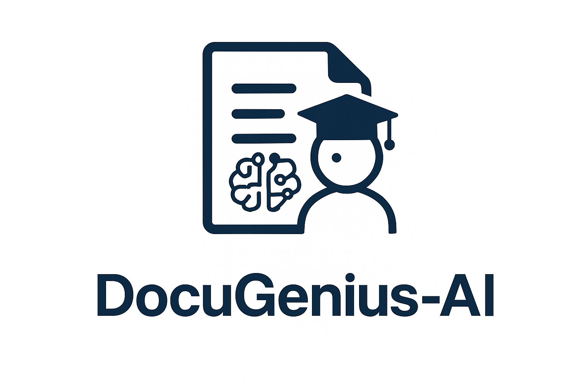
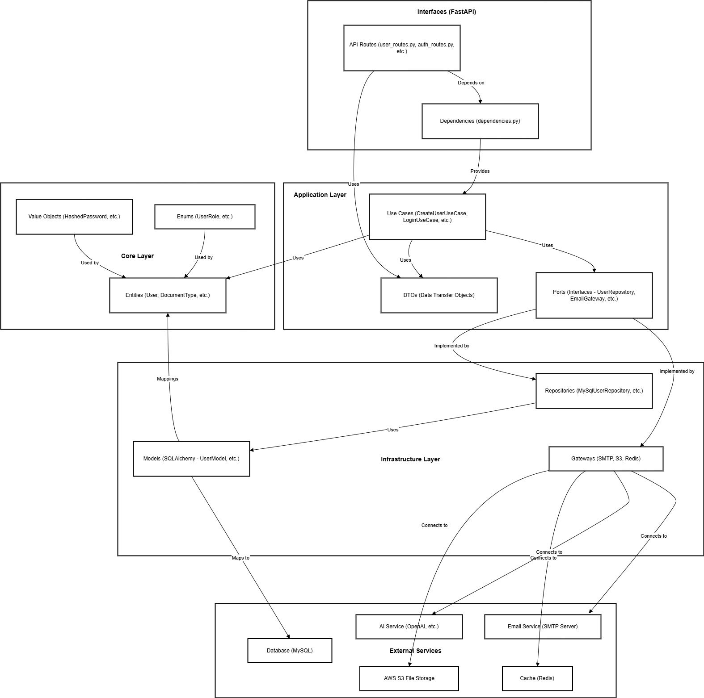

# DocuGeniusAI: AI-Driven Document Engineering Platform

<p align="center">
  
</p>

> [!NOTE]
> **Backend Complete** > The backend API is finished and ready for integration. Current development focuses on the React frontend.

**DocuGeniusAI** is a professional-grade platform designed to bridge the gap between unstructured business descriptions and structured document lifecycles. It leverages Large Language Models (LLMs) to dynamically architect business requirements into database-backed entities and production-ready documents.

---

## The Core Engineering Concept

Unlike generic AI chat interfaces, DocuGeniusAI treats AI as a **Schema Architect**. The system follows a rigorous three-stage pipeline:

1. **Discovery & Schema Generation:** The AI analyzes a business description and proposes a structured list of `Document Types`. These are not just text; they are entities to be managed and persisted.
2. **Dynamic Form Mapping:** For a selected document type, the AI generates essential data fields. These fields are automatically mapped to validated HTML tags (e.g., date, select, text) and stored as a relational schema.
3. **Final Generation:** A high-fidelity document is generated based on the previously defined and populated schema, ensuring consistency and business alignment.

## Tech Stack & Implementation Details

The project is built with a focus on **asynchronous performance**, **type safety**, and **domain-driven design**:

* **Core Framework:** `FastAPI` with `Uvicorn` for high-performance, asynchronous API execution.
* **Data Integrity:** `Pydantic v2` for strict schema validation and `pydantic[email]` for robust identity verification.
* **Database & ORM:** `SQLAlchemy 2.0` (Modern 2.0 style) using `aiomysql` for fully asynchronous database operations.
* **AI Integration:** Dual integration via `huggingface_hub` and `openai` (v2.9.0) to ensure flexibility in LLM orchestration.
* **Security:** `bcrypt` for secure credential hashing and `python-dotenv` for environment-based configuration management.

## Architectural Highlights

* **Asynchronous First:** Every layer, from API entry points to database persistence, is designed to be non-blocking.
* **Strict Typing:** Deep integration of Pydantic models to bridge the gap between AI-generated JSON and Relational Database records.
* **Zero Hallucination Pipeline:** AI outputs are treated as "proposals" that pass through a validation layer before becoming persistent business entities.
* **RBAC Ready:** Separate Administrative and User environments built to handle secure document lifecycles.

---

## Architecture & Deployment

### Backend Architecture

This diagram illustrates the high-level structure of the DocuGeniusAI backend, showing the relationship between API interfaces, application logic, core domain, infrastructure components, and external services.

 <!-- Caminho relativo à raiz do repo -->

---

## Try It Locally (Docker)

To run DocuGeniusAI locally using Docker, follow the steps below.

### Prerequisites

*   **Docker:** [Install Docker](https://docs.docker.com/get-docker/) on your machine.
*   **Docker Compose:** Usually included with Docker Desktop. If using Linux or an older version, [install Docker Compose](https://docs.docker.com/compose/install/) separately.

### Steps

1.  **Clone the repository (if applicable):**
    ```bash
    git clone https://github.com/python-projects-fernando/docugenius-ai.git
    cd docugenius-ai
    ```

2.  **Prepare the Docker Compose file:**
    *   Copy the example Docker Compose file:
      ```bash
      cp docker-compose.example.yml docker-compose.development.yml
      ```

3.  **Configure Environment Variables:**
    *   **Edit the newly created `docker-compose.development.yml` file.**
    *   Find the `environment:` section under the `bd:` and `backend:` services.
    *   Replace the placeholder values (e.g., `change_me`, `your_root_password_here`, `your_huggingface_token_here`, etc.) with your actual values for each variable.
    *   Ensure the database credentials in the `db:` service environment match the ones used in the `DATABASE_URL` variable for the `backend` service.

4.  **Build and Start the Services:**
    *   Run the following command to build the images (if necessary) and start the MySQL, Redis, and backend containers:
      ```bash
      docker-compose -f docker-compose.development.yml up --build
      ```
      *Optionally, add `-d` to the end of the command to run in the background: `docker-compose -f docker-compose.development.yml up --build -d`*

5.  **Access the Application:**
    *   The backend API will be available at `http://localhost:8000`.
    *   The API documentation (Swagger UI) will be available at `http://localhost:8000/docs`.

### Stopping the Services

To stop and remove the containers, networks, and volumes created by Docker Compose (excluding images), run:

```bash
docker-compose -f docker-compose.development.yml down
```

To also remove volumes (this will delete data in the MySQL and Redis containers), run:

```bash
docker-compose -f docker-compose.development.yml down -v
```

---

## 👤 Maintained By

This project is developed and maintained by **Fernando Antunes de Magalhães Desenvolvimento de Software Ltda.**

**Fernando Magalhães** CEO – FM ByteShift Software

📞 (21) 97250-1546

✉️ [contact@fmbyteshiftsoftware.com](mailto:contact@fmbyteshiftsoftware.com)

🌐 [fmbyteshiftsoftware.com](https://fmbyteshiftsoftware.com  )

🏢 CNPJ: 62.145.022/0001-05 (Brazil)
