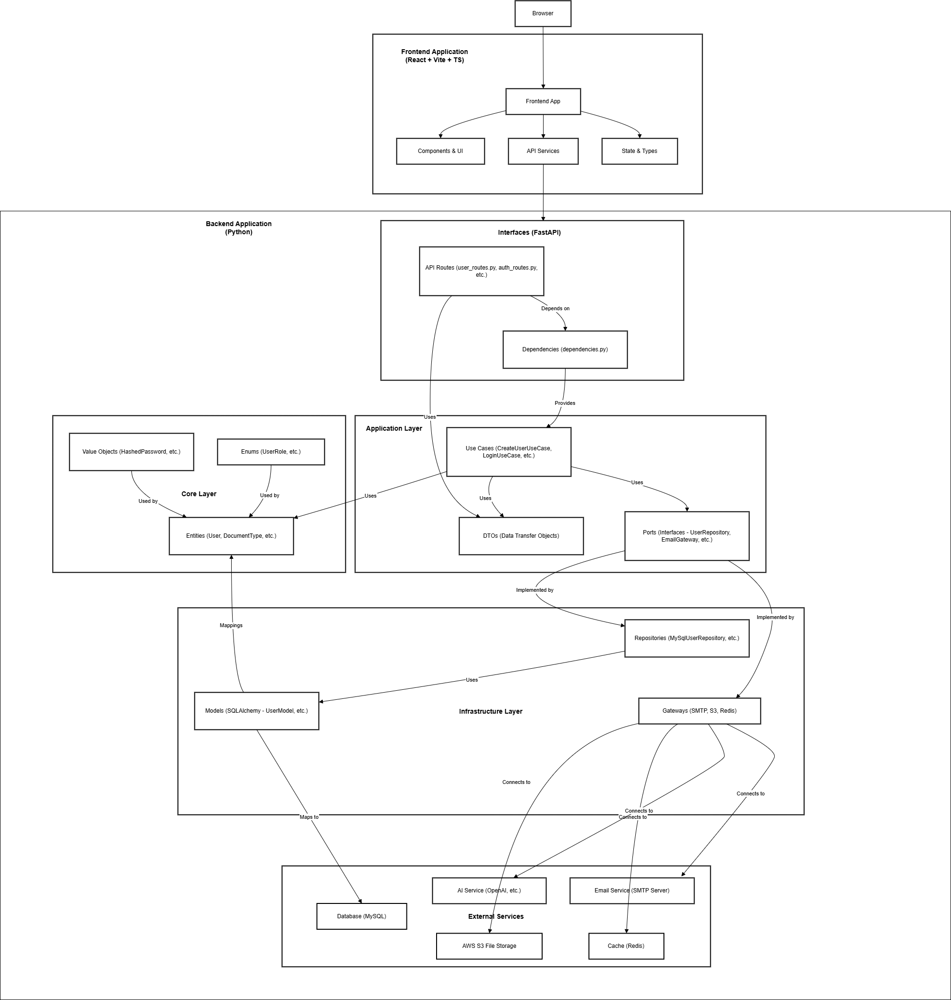

# DocuGenius-AI

## Solution Overview & Architecture

  

---

## Quick Summary (30-second read)

**What:** AI-powered document engineering platform for businesses requiring consistent, compliant document output at scale  
**Why:** Reduces document creation time by 90% through intelligent automation and standardized schema-driven generation  
**How:** Admin-configurable schemas + dynamic forms + AI-powered content assembly  
**Status:** Production-ready reference implementation  
**GitHub:** github.com/python-projects-fernando/docugenius-ai

_Continue reading for more details and methodology._

---

## Key Takeaways for Decision Makers

✓ **Flexible by design:** Works for any business sector, legal, financial, healthcare, insurance, government, or general enterprise  
✓ **Enterprise-ready:** Built for compliance, security, and scalability from day one  
✓ **Maintainable by design:** Clean Architecture reduces long-term technical debt  
✓ **Transparent process:** Full codebase available with comprehensive documentation  
✓ **AI-powered value:** Intelligent content assembly reduces manual drafting effort by up to 90%

---

## Value Proposition

**AI-powered document engineering platform** that transforms business requirements into compliant, professional documents instantly.

Built for **any business** requiring consistent, auditable document output with security, scalability, and AI-driven accuracy.

**Key Benefits:**

- Generate professional documents instantly from structured input
- Automatically assemble content using AI-powered intelligence
- Trigger workflows based on customizable business rules
- Gain insights through admin-configurable schemas
- Reduce document creation time by up to 90%

---

## Business Impact & Expected Outcomes

### Measurable Value for Your Organization

| Metric                     | Target Impact             | Why It Matters                                                                        |
| -------------------------- | ------------------------- | ------------------------------------------------------------------------------------- |
| **Document Creation Time** | 90% reduction             | Faster turnaround means improved customer satisfaction and operational efficiency     |
| **Error Reduction**        | Near-zero drafting errors | Eliminates costly mistakes in compliance-critical documents                           |
| **System Uptime**          | 99.9% target              | Critical for businesses relying on continuous document generation                     |
| **Compliance Audit**       | 100% traceability         | Meets legal, financial, and healthcare regulatory requirements with full audit trails |

### MVP Features That Deliver Value

- Admin-configurable schemas: Define document types and fields without code changes
- Dynamic form-based generation: Users fill tailored forms to generate documents instantly
- AI-powered content assembly: High-quality, formatted output using generative models
- Role-based access control: Separate environments for admins and common users

---

## Our Approach: Production-Grade Implementation

### Why This Matters for Your Project

Unlike proof-of-concept demos, DocuGeniusAI is a **production-ready reference implementation** demonstrating how Clean Architecture and modern Python & React practices deliver real business value.

**Result:** When you engage for implementation, you receive a system built on proven patterns, reducing risk, rework, and long-term maintenance cost.

### Core Design Principles

| Principle                     | Business Benefit                                                |
| ----------------------------- | --------------------------------------------------------------- |
| **Clean Architecture**        | Ensures maintainability and flexibility from day one            |
| **Schema-Driven Design**      | Enables business users to configure without code changes        |
| **Role-Based Access Control** | Protects sensitive data and meets compliance requirements       |
| **AI Integration**            | Maximizes intelligence while maintaining control and validation |
| **Scalable Infrastructure**   | Grows with your business needs without rework                   |

---

## Solution Architecture Overview

### High-Level Design

### Why This Architecture Delivers Value

**Clean Architecture** was implemented because it:

- **Reduces long-term cost:** Swap databases, AI providers, or UI frameworks without rewriting core logic
- **Accelerates testing:** Isolated business rules enable reliable automated testing
- **Supports compliance:** Clear boundaries simplify audit trails and regulatory reporting
- **Future-proofs investment:** Core business logic remains independent of framework changes

_For technical readers: Detailed component breakdown and implementation notes are in the Technical Appendix below._

---

## Technology Stack (Production-Ready)

| Category           | Technology                   | Rationale                                                            |
| ------------------ | ---------------------------- | -------------------------------------------------------------------- |
| **Language**       | Python 3.13+                 | Rich AI/ML ecosystem, strong typing, enterprise adoption             |
| **Backend**        | FastAPI                      | High performance, automatic docs, async-ready for document workflows |
| **Database**       | MySQL                        | ACID compliance, proven in enterprise document systems               |
| **Cache**          | Redis                        | Fast session management and workflow state caching                   |
| **AI Integration** | Hugging Face / LLM Providers | Access to state-of-art models for content assembly                   |
| **Frontend**       | React                        | Component reusability, strong ecosystem, team familiarity            |
| **Deployment**     | Docker + Docker Compose      | Reproducible environments, easy scaling                              |

_All choices validated through production deployment and documented in project README._

---

## Project Status

**Current Phase:** Production-Ready Reference Implementation  
**Maturity:** Functional, full application deployed and tested  
**Transparency:** Full codebase available on GitHub with setup instructions

**What This Means for You:**  
This is not a proof-of-concept, it's a working reference implementation demonstrating production-grade patterns. When you engage for implementation, you receive a system built on validated, documented choices, not assumptions.

---

## Get in Touch

**Developed by FM ByteShift Software**

**Fernando Magalhães**  
Founder & Lead Architect  
Email: contact@fmbyteshiftsoftware.com  
Website: fmbyteshiftsoftware.com  
GitHub: github.com/python-projects-fernando/docugenius-ai

---

## Technical Appendix (Optional Deep-Dive)

_For technical stakeholders who want implementation details._

### Clean Architecture: Component Breakdown

**Core Layers:**

- **Domain Entities:** Business objects (`DocumentType`, `DocumentField`, `GeneratedDocument`, `User`) with pure business logic
- **Use Cases:** Orchestration of domain logic, independent of infrastructure
- **Ports:** Interfaces defining how external systems interact with the core
- **Adapters:** Implementations for FastAPI, MySQL, Redis, AI APIs

**Key Principles Applied:**

- Dependencies point inward (Dependency Inversion)
- Core logic has zero framework dependencies
- External concerns isolated for easy testing and replacement

### Security & Compliance

- **Authentication:** JWT-based authentication with secure token management
- **Authorization:** Role-based access control (Admin vs Common users)
- **Audit Trails:** Complete logging for compliance-ready deployments

### Deployment Options

**Docker Compose (Recommended):**

- Full application stack (frontend, backend, MySQL, Redis) with single command
- Reproducible environments across development and production
- Easy scaling and maintenance

**Local Execution:**

- Backend and frontend can run separately for development
- Flexible configuration via `.env` files
- Comprehensive setup documentation in README

### MVP Implementation Scope

Current implementation includes:

- Admin schema configuration for document types and fields
- User-friendly dynamic form generation based on schemas
- AI-powered document generation with formatted output
- Role-based access control (Admin vs Common users)
- Secure authentication with default user credentials for testing
- Docker Compose setup for one-command deployment

_All components follow Clean Architecture patterns and production-grade practices._

---

_This document reflects the current state of the DocuGeniusAI reference implementation. All patterns and decisions are production-validated and documented in the project README._
